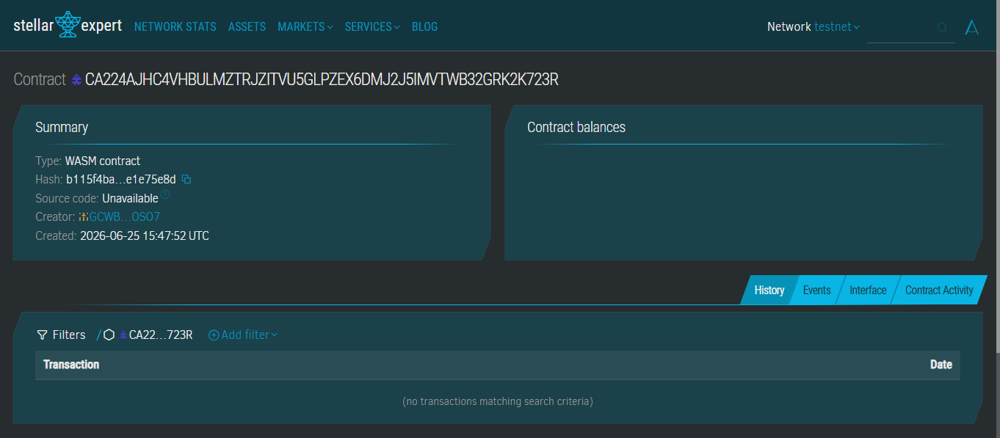

# Stellar Guestbook

A beginner-friendly decentralized application built on the **Stellar blockchain** using **Soroban smart contracts**. Users connect their Freighter wallet, write a message, and store it permanently on the Stellar Testnet.

```
Contract: CA224AJHC4VHBULMZTRJZITVU5GLPZEX6DMJ2J5IMVTWB32GRK2K723R
Network:  Stellar Testnet
Status:   ✅ Deployed & Verified
```

## Features

- Connect Freighter Wallet (Stellar browser extension)
- Write messages (max 200 characters) and submit them to the blockchain
- View all previously submitted messages with timestamps and wallet addresses
- Dark theme UI with glassmorphism design
- Works entirely on Stellar Testnet — no backend required

## Contract Deployment

The smart contract is live on **Stellar Testnet**.



| Detail | Value |
|--------|-------|
| **Contract ID** | `CA224AJHC4VHBULMZTRJZITVU5GLPZEX6DMJ2J5IMVTWB32GRK2K723R` |
| **Network** | Stellar Testnet |
| **WASM Hash** | `b115f4ba53aeb1da2172c002e6bc93ba7a5837ecf375ec74531c706ce1e75e8d` |
| **Creator** | `GCWBVEJQTGKPZUUDAV6UOP7GCFJMNSJIKYSAFX72RK22ZQXHJGDXOSO7` |
| **Deployed** | June 25, 2026 |

View on explorer: [stellar.expert](https://stellar.expert/explorer/testnet/contract/CA224AJHC4VHBULMZTRJZITVU5GLPZEX6DMJ2J5IMVTWB32GRK2K723R)

## Tech Stack

| Layer | Technology |
|-------|-----------|
| Frontend | React, TypeScript, Vite, Tailwind CSS |
| State Mgmt | React Query (TanStack Query) |
| Blockchain | Stellar Testnet, Soroban Smart Contracts |
| SDK | `@stellar/stellar-sdk` v12, `@stellar/freighter-api` v6 |
| Wallet | Freighter Wallet |
| CLI | Stellar CLI v25 |

## Project Structure

```
stellar-guestbook/
├── contracts/
│   └── guestbook/
│       ├── Cargo.toml              # Rust dependencies (soroban-sdk)
│       ├── src/
│       │   └── lib.rs              # Smart contract: add_message, get_messages
│       └── target/                 # Compiled WASM output
├── frontend/
│   ├── public/
│   │   └── stellar.svg            # Favicon
│   ├── src/
│   │   ├── components/
│   │   │   ├── ConnectWallet.tsx   # Wallet connection landing page
│   │   │   ├── Layout.tsx          # App shell with header
│   │   │   ├── MessageCard.tsx     # Individual message display
│   │   │   ├── MessageFeed.tsx     # Message list with loading/empty states
│   │   │   ├── MessageInput.tsx    # Message textarea with char counter
│   │   │   └── WalletInfo.tsx      # Connected wallet details
│   │   ├── hooks/
│   │   │   └── useWallet.ts        # Wallet connection + balance hook
│   │   ├── utils/
│   │   │   ├── contract.ts         # Soroban RPC calls (simulate, send)
│   │   │   └── freighter.ts        # Freighter API wrapper
│   │   ├── types/
│   │   │   └── index.ts            # TypeScript interfaces
│   │   ├── App.tsx                 # Root component with routes
│   │   ├── main.tsx                # Entry point (QueryClient + Router)
│   │   ├── index.css               # Tailwind directives
│   │   └── vite-env.d.ts           # Vite env type declarations
│   ├── .env                        # Environment variables (contract ID, RPC URLs)
│   ├── index.html
│   ├── package.json
│   ├── tailwind.config.js
│   ├── postcss.config.js
│   ├── tsconfig.json
│   └── vite.config.ts
├── .gitignore
└── README.md
```

## Prerequisites

### 1. Install Rust

```bash
# Windows (download installer):
# https://rustup.rs

# macOS / Linux:
curl --proto '=https' --tlsv1.2 -sSf https://sh.rustup.rs | sh
```

### 2. Install Stellar CLI

```bash
# Windows (via winget):
winget install --id Stellar.StellarCLI

# macOS (via Homebrew):
brew install stellar-cli

# Linux / Other:
# Download from: https://github.com/stellar/stellar-cli/releases
```

Verify installation:

```bash
stellar --version
# Expected: stellar 25.x.x
```

### 3. Install Freighter Wallet

- [Freighter for Chrome](https://chromewebstore.google.com/detail/freighter/bcacfldlkkdogcmkkibnjlakofdplcbk)
- [Freighter for Firefox](https://addons.mozilla.org/en-US/firefox/addon/freighter/)

Create a wallet, switch to **Testnet** in settings.

### 4. Fund Your Wallet

Use the Stellar Lab friendbot to get testnet XLM:

```bash
curl "https://friendbot.stellar.org?addr=YOUR_PUBLIC_KEY"
```

Or visit the [Stellar Lab](https://lab.stellar.org/account/fund) and fund your address.

## Quick Start

### 1. Install Frontend Dependencies

```bash
cd frontend
npm install
```

### 2. Configure Environment

Edit `frontend/.env` with your contract ID:

```env
VITE_CONTRACT_ID=CA224AJHC4VHBULMZTRJZITVU5GLPZEX6DMJ2J5IMVTWB32GRK2K723R
VITE_RPC_URL=https://soroban-testnet.stellar.org
VITE_NETWORK_PASSPHRASE=Test SDF Network ; September 2015
VITE_HORIZON_URL=https://horizon-testnet.stellar.org
VITE_FALLBACK_ACCOUNT=GCWBVEJQTGKPZUUDAV6UOP7GCFJMNSJIKYSAFX72RK22ZQXHJGDXOSO7
```

> `VITE_FALLBACK_ACCOUNT` is a funded testnet account used for read-only contract simulations when the user's own account is not yet funded.

### 3. Run the Development Server

```bash
npm run dev
```

Open `http://localhost:5173` in your browser.

### 4. Connect Wallet

Click **Connect Wallet** — Freighter will prompt you to authorize the app.

### 5. Write a Message

Type a message (up to 200 characters) and click **Submit to Blockchain**. Freighter will ask you to sign the transaction.

### 6. View Messages

All submitted messages appear in the **Guestbook Feed**, automatically refreshing every 30 seconds.

## Smart Contract

The Soroban contract is at `contracts/guestbook/src/lib.rs`.

### Functions

#### `add_message(wallet, text, timestamp)`

Stores a message on-chain with the sender's wallet address and timestamp.

- `wallet`: `String` — the sender's Stellar public key
- `text`: `String` — the message (1–200 characters)
- `timestamp`: `u64` — Unix timestamp in seconds

#### `get_messages() → Vec<Message>`

Returns all stored messages.

### Message Structure

```rust
pub struct Message {
    pub wallet: String,
    pub text: String,
    pub timestamp: u64,
}
```

### Validation

- Empty messages are rejected with `"message cannot be empty"`
- Messages longer than 200 characters are rejected with `"message exceeds maximum length of 200 characters"`

### Build the Contract

```bash
cd contracts/guestbook
stellar contract build
```

Output: `target/wasm32v1-none/release/guestbook.wasm`

### Deploy to Testnet

```bash
stellar contract deploy \
  --wasm target/wasm32v1-none/release/guestbook.wasm \
  --source YOUR_KEY_ALIAS \
  --network testnet
```

This returns a contract ID (e.g. `CA224AJHC4VHBULMZTRJZITVU5GLPZEX6DMJ2J5IMVTWB32GRK2K723R`).

### Test with CLI

```bash
# Add a message
stellar contract invoke \
  --id YOUR_CONTRACT_ID \
  --source alice \
  --network testnet \
  -- \
  add_message \
  --wallet "GCWBVEJQTGKPZUUDAV6UOP7GCFJMNSJIKYSAFX72RK22ZQXHJGDXOSO7" \
  --text "Hello Stellar!" \
  --timestamp 1800000000

# Read messages
stellar contract invoke \
  --id YOUR_CONTRACT_ID \
  --source alice \
  --network testnet \
  -- \
  get_messages
```

## Frontend Architecture

### Data Flow

```
User Action → Freighter API → Soroban RPC → Stellar Testnet
    ↓                                            ↓
React Query Cache ←─── simulateTransaction ──────┘
    ↓
UI Components (MessageFeed, MessageCard)
```

### Key Files

| File | Purpose |
|------|---------|
| `utils/freighter.ts` | Wraps `@stellar/freighter-api` v6 — connection, address, network details |
| `utils/contract.ts` | Builds transactions, calls `simulateTransaction`/`sendTransaction`, parses ScVal |
| `hooks/useWallet.ts` | React hook — connects Freighter, fetches balance from Horizon |
| `components/MessageFeed.tsx` | React Query — polls `get_messages` every 30s, loading/error/empty states |
| `components/MessageInput.tsx` | Form with character counter, triggers `addMessage` mutation |

### Design Decisions

- **`prepareTransaction`**: Used in `addMessage` to auto-simulate and set the correct ledger footprint and resource fees before signing
- **`simulateTransaction`**: Used for `get_messages` — builds a read-only transaction, simulates it, and parses the `retval` ScVal
- **Fallback account**: If the user's wallet hasn't been funded on testnet, the feed falls back to a known funded account for read simulations
- **React Query**: `queryKey: ["messages"]` with 30s `refetchInterval` keeps the feed current

## Scripts

```bash
# Frontend
cd frontend
npm run dev      # Development server at localhost:5173
npm run build    # TypeScript check + Vite production build
npm run preview  # Preview production build
npm run lint     # TypeScript type checking

# Contract
cd contracts/guestbook
stellar contract build    # Compile to WASM
```

## Common Issues

### "Freighter wallet not detected"
- Install the [Freighter browser extension](https://freighter.app)
- Refresh the page after installing

### "Transaction submission failed"
- Make sure your wallet is on **Testnet** (not Mainnet)
- Ensure you have testnet XLM (use the friendbot)
- Check the RPC URL is correct (`https://soroban-testnet.stellar.org`)

### "Failed to fetch messages"
- Verify `VITE_CONTRACT_ID` is set correctly in `.env`
- The contract must be deployed first

### Empty guestbook feed
- New contracts have no messages — be the first to submit one!
- If your account isn't funded, the fallback account is used for reads

## Resources

- [Stellar Developers](https://developers.stellar.org)
- [Soroban Documentation](https://developers.stellar.org/docs/build/smart-contracts/overview)
- [Stellar CLI Docs](https://developers.stellar.org/docs/tools/developer-tools/cli/stellar-cli)
- [Freighter API Docs](https://docs.freighter.app)
- [Stellar SDK (JS)](https://github.com/stellar/js-stellar-sdk)
- [Stellar Lab](https://lab.stellar.org)
- [Stellar Expert Explorer](https://stellar.expert/explorer/testnet)

## License

MIT
